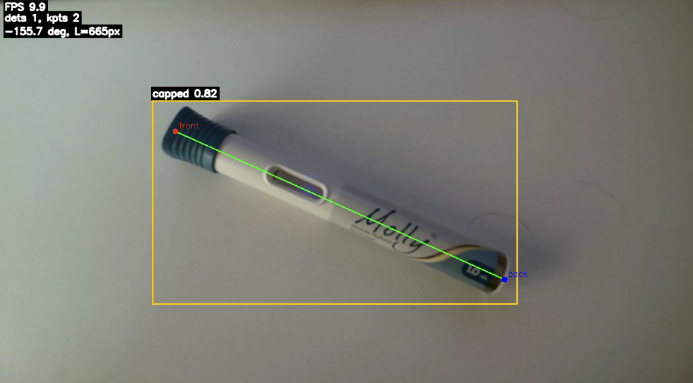

# 🎯 Autoinjector Object Detection Pipeline




> **Real-time AI that sees more than meets the eye** — detecting autoinjectors and tracking their precise orientation in 3D space using cutting-edge YOLO pose estimation.

Ever wondered how machines "see" and understand object orientation in real-time? This project brings together state-of-the-art computer vision, pose estimation, and production-ready engineering to create an intelligent system that detects autoinjectors (capped or uncapped) and tracks their keypoint locations with sub-pixel accuracy.

*Real-time pose estimation with bounding boxes, keypoints, orientation angle, and FPS counter*

## 🚀 What It Does

This pipeline trains and deploys a custom YOLO pose model that:
- **Detects** autoinjectors in real-time video streams
- **Classifies** their state (capped/uncapped)
- **Estimates pose** by tracking keypoints (front tip and back base)
- **Calculates orientation** with live angle and length measurements
- **Smooths tracking** using EMA filtering for stable, jitter-free visualization

## ⚡ Quick Start

### Train Your Model
```bash
cd model_training
# Open Train.ipynb and follow the training pipeline
# Configure your dataset path in config.yaml
```

### Run Real-Time Demo
```bash
cd demo
python auto_injector_pose_demo.py \
    --model ../model_training/training_runs/example_results/weights/best.pt \
    --source ""  # Empty for webcam, or provide video path
```

### Or Use the Jupyter Notebook
```bash
cd demo
jupyter notebook Demo.ipynb
# Configure model path and device, then run!
```

## 🎨 Key Features

- **🧠 Smart Detection**: YOLO11 pose model fine-tuned for autoinjector recognition
- **🎯 Precise Tracking**: Exponential Moving Average (EMA) smoothing for stable keypoints
- **⚡ Performance Optimized**: FP16 inference, model warmup, and FPS throttling
- **🖥️ Multi-Platform**: Supports CUDA (NVIDIA), MPS (Apple Silicon), and CPU
- **📊 Production Ready**: Robust error handling, graceful degradation, and comprehensive logging

## 📁 Project Structure

```
ai-object-detection-pipeline/
├── model_training/          # Training pipeline and configs
│   ├── Train.ipynb         # Model training notebook
│   ├── config.yaml         # Dataset and training configuration
│   └── training_runs/      # Training outputs and model weights
├── demo/                   # Real-time inference demos
│   ├── Demo.ipynb          # Interactive Jupyter demo
│   └── auto_injector_pose_demo.py  # Standalone Python script
└── data/                   # Dataset (images and labels)
    └── sample_dataset/     # Example training data
```

## 🛠️ Requirements

```bash
pip install ultralytics opencv-python numpy
```

For GPU acceleration (optional):
- **NVIDIA**: CUDA-enabled PyTorch (enables FP16, ~2x speedup)
- **Apple Silicon**: MPS support (note: pose models may have issues, use CPU if needed)
- **CPU**: Works everywhere, slower but fully compatible

## 🎓 Technical Highlights

- **Pose Estimation**: 2 keypoints (front tip, back base) with confidence scoring
- **Temporal Smoothing**: EMA filter (α=0.4) reduces jitter while maintaining responsiveness
- **Memory Optimization**: Contiguous array checks, efficient tensor operations
- **Camera Integration**: OS-specific backend optimization (AVFoundation, DSHOW, V4L2)

## 📝 Notes

- Model schema: Classes `{0: 'capped', 1: 'uncapped'}`, Keypoints `{0: 'front', 1: 'back'}`
- Apple MPS users: May encounter pose model issues — use `device="cpu"` as fallback
- Performance: ~24 FPS on modern hardware with GPU acceleration

---

**Built with** ❤️ **using YOLO, OpenCV, and a passion for computer vision**
